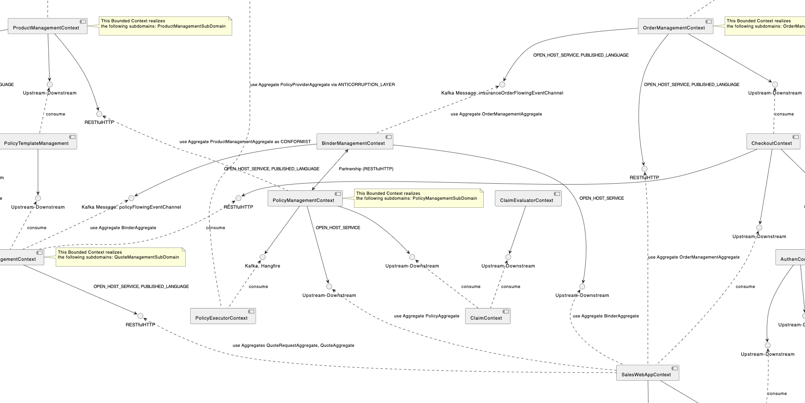
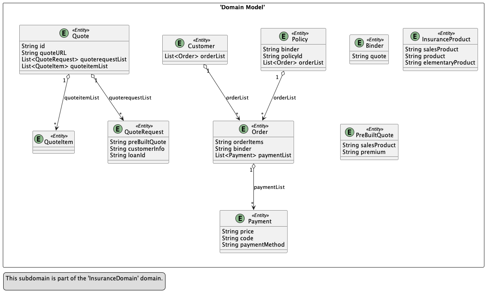
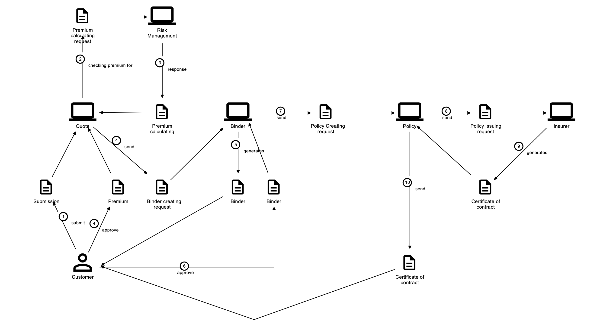
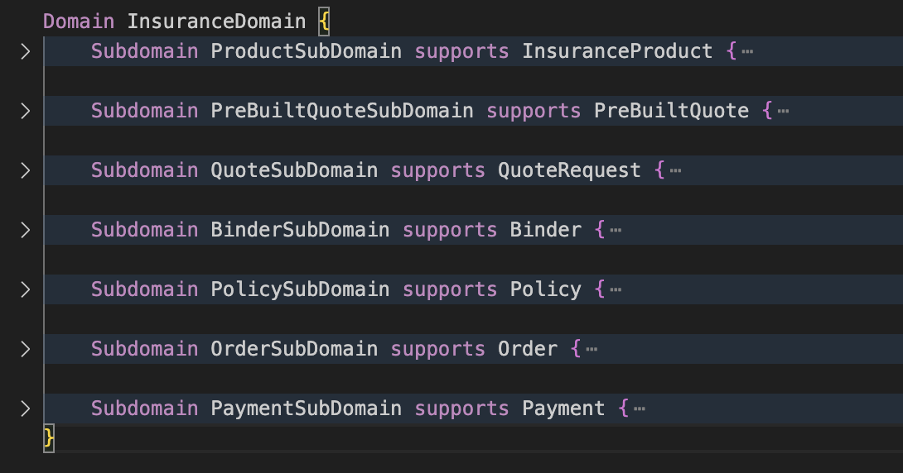
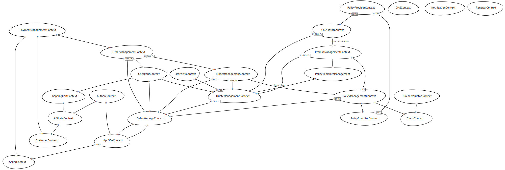

# designing_a_microservice_architecture
<a name="readme-top"></a>


<!-- PROJECT LOGO -->
<br />
<div align="center">
  <a href="https://github.com/anhle271090/designing_a_microservice_architecture">
    
  </a>

  <h3 align="center">Designing a microservice architecture</h3>

  <p align="center">
    This is my real journey of Designing a microservice architecture.
  </p>
</div>


<!-- TABLE OF CONTENTS 
<details>
  <summary>Table of Contents</summary>
  <ol>
    <li>
      <a href="#about-the-project">About The Project</a>
      <ul>
        <li><a href="#built-with">Built With</a></li>
      </ul>
    </li>
    <li>
      <a href="#getting-started">Getting Started</a>
      <ul>
        <li><a href="#prerequisites">Prerequisites</a></li>
        <li><a href="#installation">Installation</a></li>
      </ul>
    </li>
    <li><a href="#usage">Usage</a></li>
    <li><a href="#roadmap">Roadmap</a></li>
    <li><a href="#contributing">Contributing</a></li>
    <li><a href="#license">License</a></li>
    <li><a href="#contact">Contact</a></li>
    <li><a href="#acknowledgments">Acknowledgments</a></li>
  </ol>
</details>
-->


<!-- ABOUT THE PROJECT -->
## About The Project

[![Product Name Screen Shot][product-screenshot]](https://example.com)

Starting with a frontend developer position and going through many different projects, I have been working on building a microservice system with a lot of challenges.
I wrote this project to remind myself of what I have done wrong and right so far.

Here are some of my main points:
* Mistakes that lead to a bad implementation of microservices.
* Correcting mistakes continuously to build better microservices (I'm sure that it's still not good enough)
* My lessons learned

Of course, this is only based on my own experiences. Thanks to all the people!


## Bad microservices ❗

### Context: Third Party Administrator for Insurance Company
My team was responsible for building a system that helps an insurance company branch to manage their policies and claims. It also integrates with the HO and other company's systems.

### Problems:
#### God service and multiple CRUD services.
At the beginning, we had some small services working together to provide all the requirements. 
<br/>
Over time, we received frequent change requests. The easy way to adapt to this was to add more functions to the existing code.
<br/>
Eventually, we had a god service that contained a lot of functions. It became a single point of failure. Other services were just CRUD services. This led us to a big problem.

#### Missing related components:
* API Gateway
* Service Registry
* SSO
* Message bus: all services work together by APIs
  <br/>

<!-- GETTING STARTED -->
## Better microservices ✅

Basically, the requirement is about building an insurance platform that can:
* Manage insurance products with three levels and four lines of products
* Allow customizing product's attributes and premium formulas
* Allow customizing workflows for sales and issuing policies
* Integrate with multiple insurance providers
* Support claim creation
  
### Which approach did I use for this platform?
* Domain Driven Design: this is an approach to developing software for complex needs.
  * To me, this approach is suitable for complicated business applications
 
### 1. Stagetic phase/Designing architecture/High level picture.

#### Step 1: Defining user stories
Start with application’s requirements, e.g. user stories/scenarios, non-functional requirements.
<br/>
<i>Note: This is an example of how to buy an insurance. It's not a full work</i>
* User stories
  ```js
  UserStory InsuranceProduct{
	As an "Admin"
	I want to "create" a "InsuranceProduct" with its "SalesProduct", "Product", "ElementaryProduct"
	so that "Manage insurance product"
  }
  
  UserStory PreBuiltQuote{
  	As a "Operation Admin"
  	I want to "create" "PreBuiltQuote" with its "SalesProduct"
  	I want to "calculate" a "PreBuiltQuote" with its "premium"
  	so that "pre-built insurance product for customer so that can be easy for buying"
  }
  
  UserStory QuoteRequest{
  	As a "3rd Party Employee"
  	I want to "submit" a "QuoteRequest" with its "PreBuiltQuote", "CustomerInfo", "LoanId" for a "Quote"
  	I want to read "Quote" with its "Id", "QuoteURL"
  	I want to read "QuoteItem" in "Quote"
  	so that "I can request insurace quote to insurance company"
  }
  
  UserStory Binder{
  	As a "Order system"
  	I want to "create" a "Binder" with its "Quote"
  	I want to "confirm" a "Binder"
  	so that "I can manage Binder for Policy"
  }
  
  UserStory Policy{
  	As a "Quote System"
  	I want to "create" a "Policy" with its "Binder"
  	I want to update a "Policy"
  	I want to read a "Policy" with its "policyId"
  	so that "Manage customer's policy."
  }

  UserStory Order{
  	As a "Quote System"
  	I want to "create" an "Order" with its "OrderItems" for "Customer"
  	I want to "accept" an "Order" with its "Binder" for "Policy"
  	I want to "checkout" "Order" to "Customer"
  	so that "I can issue a policy for quote thought order and payment"
  }
  
  UserStory Payment{
  	As an "Order System"
  	I want to "create" an "Payment" with its "Price", "Code", "PaymentMethod" for "Order"
  	// I want to "pay" a "Payment" to "Order"
  	// I want to "reject" a "Payment"
  	so that "Manage order's payment"
  }
  ```

  
#### Step 2: Defining Domain Model
The sencond step: distills the requirements into a set of system operations.
<br/>
The deliverables consist of Domain Model:
<br/>
<a href="https://github.com/anhle271090/designing_a_microservice_architecture/ddd_strategic_design/InsuranceDomain_simpler_DomainModel.png">
    
</a>
</br>
<i>Note: This is an example of how to buy an insurance. It's not a full work.</i>
<i>This model don't contain entity's behaviors. I'll update for it later</i>
<br/>
<br/>

Tips: If you want a tool to transform domain knowledge into effective business software.
I found this tool: Domain Storytelling. It brings together domain experts and development teams
<br/>
Project Link: [egon app](https://egon.io/app-v2/)
<br/>
Here is my sample for it:
<br/>
<a href="https://github.com/anhle271090/designing_a_microservice_architecture/ddd_strategic_design/Domain_storytelling_example.png">
    
</a>


#### Step 3: Defining Subdomains
Defining subdomains is challenging because it’s a creative activity (not something you can buy, download or read in a manual).
It requires a clear understanding of the business. In my case, I had a chance to meet domain experts and spend enough time with them.
<br/>
* ProductSubDomain: Manage insurance product for a Admin
* PreBuiltQuoteSubDomain: pre-built insurance product for customer so that can be easy for buying
* QuoteSubDomain: employee can request insurace quote to insurance company
* BinderSubDomain: Order system can manage Binder for Policy
* PolicySubDomain: Manage customer's policy.
* OrderSubDomain: Quote System can issue a policy for quote thought order and payment
* PaymentSubDomain: Manage order's payment

<a href="https://github.com/anhle271090/designing_a_microservice_architecture/ddd_strategic_design/Define_sub_domains.png">
    
</a>

#### Step 4: Defining Bounded Contexts
Bounded context is the hardest thing in my jouney. Till now, I'm still practicing for this step.
</br>
Read more at: [Link](https://martinfowler.com/bliki/BoundedContext.html)
</br>
Here is my example for defining bounded contexts based on the design at step 3:
</br>
* PolicyBoundedContext: PolicySubDomain and BinderSubDomain
* SalesBoundedConext: OrderSubDomain
* FinanceBoundedContext: PaymentSubDomain
* QuoteBoundedContext: PreBuiltQuoteSubDomain and QuoteSubDomain

#### Step 5: Bounded Contexts and Context map
##### Bounded Contexts:
After updating the design with a lot of new requirements,
</br>
I have a better context map with some more bounded contexts.
</br>
##### Context map:
To me, defining integration patterns between bounded contexts is very important. It is a powerful tool for me to design service collaborations, choose implementation technology, and organize teams.
To make decisions, I have some guidelines like this:
* Which one is upstream/downstream?
* Which one is core domain, suporting or generic subdomains?
* Which one has higher priority in changing the model?
  
</br>
My bounded context map:
</br>
<a href="https://github.com/anhle271090/designing_a_microservice_architecture/ddd_strategic_design/InsuranceDomain_simpler_ContextMap.svg">
    
</a>
</br>
<i>Note: this is only a simple example. It's not a final design</i>

### 2. Designing services
Before move to designing services path. I want to talk about: What is the hardest part about microservices?
* Identify services: 
	* Decompose by subdomains or business capability?
 	* In my case, I used `Bounded Context` to model the domain. However, it's based on my real experience about business capability (company organization).
* Maintaining Data Consistency: Database per service pattern lead us to: can not use ACID transactions
	* `SAGA pattern` is my decision.
 		* With each step: Paticipant/Transaction/Compensation Transaction
   		* Missing in implementation: canceling a pending Saga and lacking of I in ACID.
* Communication: Since each microservice is typically self-contained, it can be difficult to communicate with them effectively
	* APIs is a good way for communication. However, how can we design good APIs? REST
 	* Loose coupled services: I used `Kafka` for message bus in my system (why don't use `RabbitMQ`? -> Reusing existing technology).
* Long-running process: A long running process can span from a few milliseconds up to decade to complete a business process.
	* A common challenge is to manage the state and progress.
 		* In my solution, I used workflow engine ([ELSA](https://github.com/elsa-workflows/elsa-core/tree/2.x)) to **`orchestrate`** the process of `Sales subdomains`.
   		* With group of `Policy subdomains`: I pick **`choreophy`** approach.

#### Defining services
_There are many ways to define micro-service scope. To me, I based on bounded contexts, actors and operations that work through multiple subdomains._
</br>
To be more simpler, a bounded context is a service 😇. Finally, I have `10 services` and 5 `web apps`.

#### Designing service collaboration
_I can not show all steps and informaion about how I design service collabroation._
</br>In generally, some of my output consist of:
</br>
</br>
a. Basic application design:
_more details later_
</br>
<a href="https://github.com/anhle271090/designing_a_microservice_architecture/blob/main/tatical_design/Service_Components.svg">
    
</a>
</br>
</br>
b. Order management application design:
_more details later_
</br>
<a href="https://github.com/anhle271090/designing_a_microservice_architecture/blob/main/tatical_design/Order_Application_Design_Defining-Software architect.svg">
    
</a>
</br>
</br>
c. Long-running process design:
_more details later_
</br>
<a href="https://github.com/anhle271090/designing_a_microservice_architecture/blob/main/tatical_design/Order_Application_Design_Defining-Sales-Flowing.svg">
    
</a>


##### 

#### Designing service's APIs
_input later_

<!-- ROADMAP -->
## Roadmap

- [ ] Add related components: API Gateway/Service registry/SSO/Identity Server
- [ ] CQRS implementation
- [ ] Add "Observability" component


<p align="right">(<a href="#readme-top">back to top</a>)</p>

<!-- ACKNOWLEDGMENTS -->
## Acknowledgments

Use this space to list resources you find helpful and would like to give credit to.

* [Context mapper](https://contextmapper.org)
* [microservices.io](https://microservices.io/index.html)
* [egon app](https://egon.io/app-v2/)
* [ELSA](https://github.com/elsa-workflows/elsa-core/tree/2.x)

<p align="right">(<a href="#readme-top">back to top</a>)</p>


<!-- MARKDOWN LINKS & IMAGES -->
[product-screenshot]: ddd_strategic_design/final_screenshot.png
